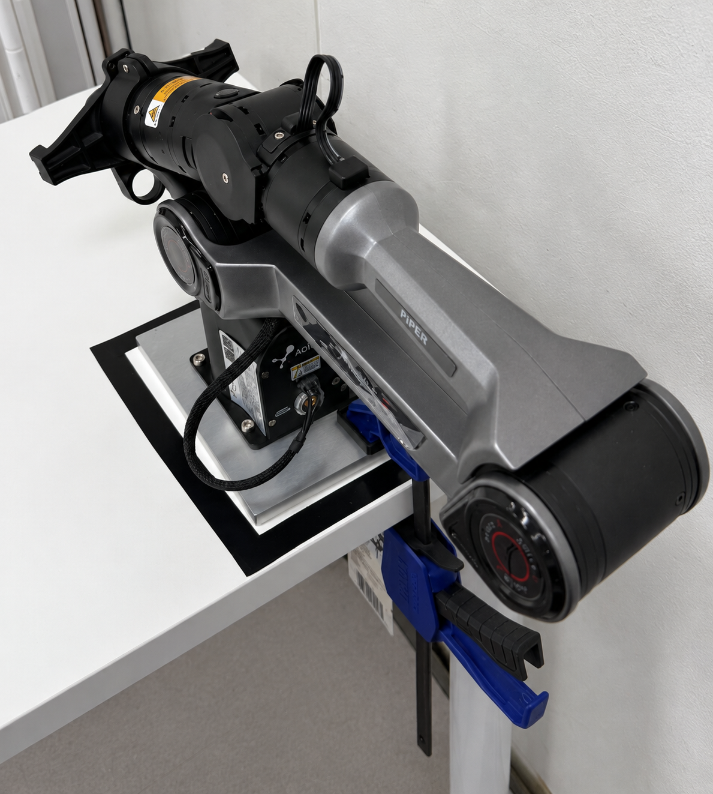
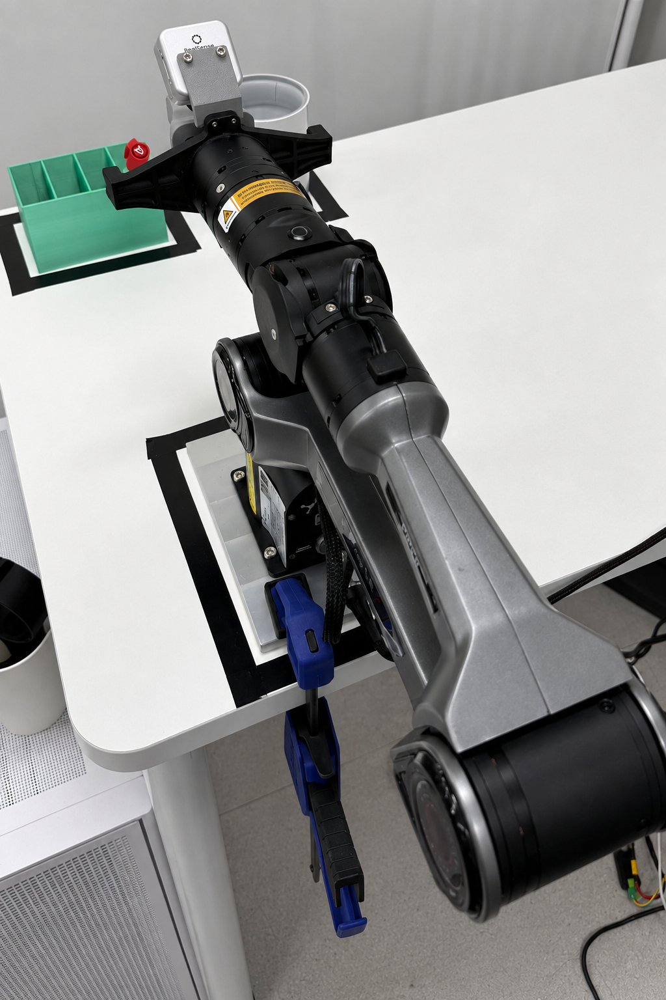
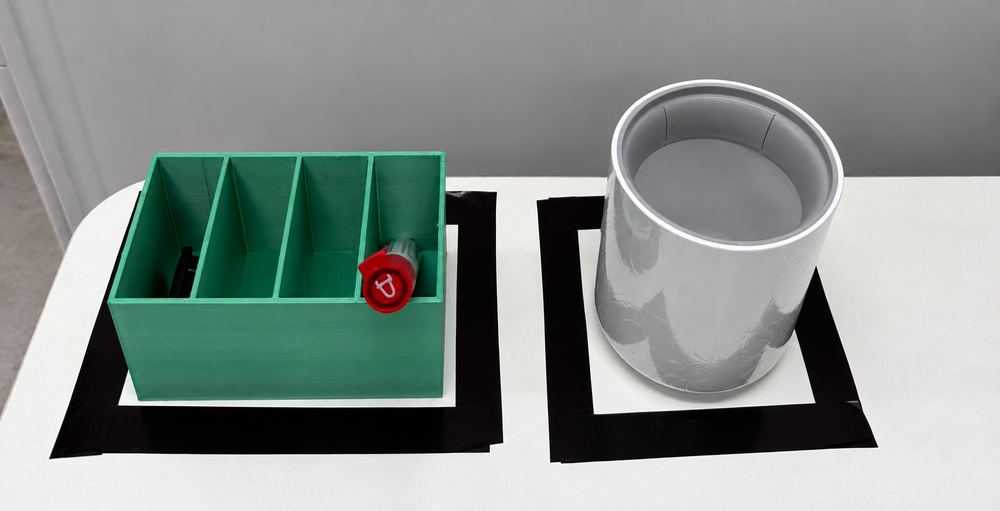
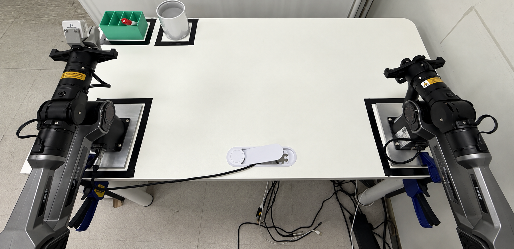

# PiPER Real Robot Setup & ACT

This project covers ROS 2 Foxy setup for PiPER robot arms, Leader–Follower teleoperation, wrist camera mounting, demonstration collection, and imitation learning with ACT (Action Chunking with Transformers).

## 1. Environment Setup

### 1.1 Hardware and Software

| Component | Configuration |
| --- | --- |
| Operating system | Ubuntu 20.04 |
| ROS 2 | Foxy |
| ROS Python | Python 3.8 |
| Robot arms | Two AgileX PiPER arms |
| Python SDK | pyAgxArm |
| ROS 2 driver | agx_arm_ros, `ros2` branch |
| Wrist camera | Intel RealSense D405 |
| Learning method | ACT imitation learning |
| Task | Pick a pen from one pen holder and place it in another |

#### Model Training Environment

The original ACT models were trained with the following environment:

| Component | Configuration |
| --- | --- |
| Python | 3.10.8 |
| PyTorch | 2.7.1+cu128 |
| torchvision | 0.22.1+cu128 |
| GPU | NVIDIA RTX 5080 |

#### Robot Runtime

The robot driver runs on Ubuntu 20.04 with ROS 2 Foxy. ACT inference runs in the `piper_act` Conda environment and sends predicted joint targets to the Follower. The Python interpreter used for ROS inference must be compatible with the installed `rclpy` and `cv_bridge` modules.

#### Robot Firmware

After installing the SDK and connecting the robot, query its firmware. Set `channel` to the interface connected to the selected arm.

```python
from pyAgxArm import create_agx_arm_config, AgxArmFactory
import time

config = create_agx_arm_config(robot="piper", comm="can", channel="can0")
arm = AgxArmFactory.create_arm(config)
arm.connect()
try:
    time.sleep(1)
    print("Firmware:", arm.get_firmware(timeout=2.0))
finally:
    arm.disconnect()
```

Firmware information recorded for the robot:

```text
hardware_version      H-V1.2-1
motor_ratio_and_batch  10
node_type             ARM_MC
software_version      S-V1.5-8
production_date       250116
node_number           15
```

### 1.2 SDK and ROS 2 Driver Installation

#### Python SDK

```bash
git clone https://github.com/agilexrobotics/pyAgxArm.git
cd pyAgxArm
pip3 install .
```

#### ROS 2 Workspace

```bash
# Run from this project root.
export PIPER_PROJECT_ROOT="$PWD"
mkdir -p ~/agx_arm_ws/src
cp -a "$PIPER_PROJECT_ROOT/agx_arm_ws/src/agx_arm_ros" ~/agx_arm_ws/src/
```

Run the repository's dependency installation script:

```bash
cd ~/agx_arm_ws/src/agx_arm_ros/scripts
chmod +x agx_arm_install_deps.sh
bash ./agx_arm_install_deps.sh
```

The dependency list below uses Foxy package names. `topic-tools` was omitted from this setup.

```bash
pip3 install python-can scipy numpy
sudo apt update
sudo apt install can-utils ethtool

sudo apt install -y \
  ros-foxy-ros2-control \
  ros-foxy-ros2-controllers \
  ros-foxy-controller-manager \
  ros-foxy-joint-state-publisher-gui \
  ros-foxy-robot-state-publisher \
  ros-foxy-xacro \
  python3-colcon-common-extensions

sudo apt install -y \
  ros-foxy-moveit \
  ros-foxy-joint-trajectory-controller \
  ros-foxy-joint-state-controller \
  ros-foxy-gripper-controllers \
  ros-foxy-trajectory-msgs
```

Check the active Python environment and build the workspace:

```bash
which pip3
source /opt/ros/foxy/setup.zsh
cd ~/agx_arm_ws
colcon build
source ~/agx_arm_ws/install/setup.zsh
```

On Linux, robot communication uses SocketCAN. The SDK's `channel` selects the corresponding CAN interface.

```python
interface = "socketcan"
channel = "can0"
```

### 1.3 ROS 2 Foxy Compatibility Changes

The ROS 2 driver source used in this project is included at [`agx_arm_ws/src/agx_arm_ros`](agx_arm_ws/src/agx_arm_ros), with its URDF assets and local modifications. This preserves its original workspace layout. The source is based on upstream commit `b9ad14de2a6eb818a2d206fbd1adba48343662f7` and includes Foxy compatibility, Leader–Follower control, gripper command handling, and helper nodes. Copy the included driver into your ROS workspace before building.

Some launch and MoveIt APIs used by the upstream driver are unavailable in Foxy. The following changes are already included in the bundled source and are documented relative to:

```text
~/agx_arm_ws/src/agx_arm_ros
```

#### Launch API

In `src/agx_arm_ctrl/launch/start_single_agx_arm.launch.py`, replace the `Node()` argument `ros_arguments` with `arguments`:

```python
# Before
ros_arguments=['--log-level', LaunchConfiguration('log_level')],

# After
arguments=[
    '--ros-args',
    '--log-level',
    LaunchConfiguration('log_level'),
],
```

In `start_single_agx_arm_moveit.launch.py`, replace `IfElseSubstitution` with `PythonExpression`:

```python
from launch.substitutions import LaunchConfiguration, PythonExpression

'control_enabled': PythonExpression([
    "'false' if '",
    LaunchConfiguration('auto_control_gate'),
    "' == 'true' else 'true'",
]),
```

#### Xacro and ros2_control

Update `src/agx_arm_moveit/config/agx_arm.ros2_control.xacro`:

| Before | After |
| --- | --- |
| `xacro.load_yaml(initial_positions_file)` | `load_yaml(initial_positions_file)` |
| `mock_components/GenericSystem` | `fake_components/GenericSystem` |

#### MoveIt Configuration

Replace `MoveItConfigsBuilder` in `_moveit_config_builder.py` with direct Xacro, YAML, and SRDF loading. Generate the robot descriptions, load kinematics and controller settings, configure OMPL/RRTConnect, and merge the sections into a `parameters` dictionary.

Update consumers of the configuration from object attributes to dictionary keys:

```python
# Before
moveit_config.robot_description
moveit_config.package_path
moveit_config.to_dict()

# After
moveit_config['robot_description']
moveit_config['package_path']
moveit_config['parameters']
```

| File, relative to `src/agx_arm_moveit/` | Change |
| --- | --- |
| `launch/demo.launch.py` | Dictionary access and `DeclareLaunchArgument` with string defaults |
| `launch/move_group.launch.py` | Merged parameters, dictionary paths, and updated Boolean arguments |
| `launch/moveit_rviz.launch.py` | Dictionary access for RViz parameters |
| `launch/rsp.launch.py` | Dictionary access for the robot description |
| `launch/spawn_controllers.launch.py` | Direct `controller_manager/spawner.py` nodes |
| `launch/static_virtual_joint_tfs.launch.py` | Static TF nodes generated from fixed SRDF virtual joints |
| `launch/warehouse_db.launch.py` | Direct MongoDB wrapper node |
| `package.xml` | Remove the `moveit_configs_utils` runtime dependency |

<details>
<summary>Detailed Foxy compatibility changes</summary>

The following excerpts replace parts of the existing launch files. Keep the existing logic that creates `profile`, `arm_type`, `urdf_mappings`, and `srdf_mappings` in `build_moveit_config(context)`.

##### `agx_arm.ros2_control.xacro`

```xml
<!-- Before -->
<xacro:property name="initial_positions"
  value="${xacro.load_yaml(initial_positions_file)['initial_positions']}" />
<plugin>mock_components/GenericSystem</plugin>

<!-- After -->
<xacro:property name="initial_positions"
  value="${load_yaml(initial_positions_file)['initial_positions']}" />
<plugin>fake_components/GenericSystem</plugin>
```

##### `_moveit_config_builder.py`

Remove `from moveit_configs_utils import MoveItConfigsBuilder` and use these imports:

```python
from pathlib import Path
import xml.etree.ElementTree as ET

import xacro
import yaml
from ament_index_python.packages import get_package_share_directory
```

Replace the `MoveItConfigsBuilder(...).robot_description(...).robot_description_semantic(...).to_moveit_configs()` chain with the following configuration inside the function:

```python
package_path = Path(get_package_share_directory("agx_arm_moveit"))
config_path = package_path / "config"

def load(name):
    with (config_path / name).open() as stream:
        return yaml.safe_load(stream) or {}

mappings = dict(urdf_mappings)
mappings["initial_positions_file"] = str(config_path / "initial_positions.yaml")
description = xacro.process_file(
    str(config_path / "agx_arm.urdf.xacro"), mappings=mappings).toxml()
semantic = xacro.process_file(
    str(config_path / "agx_arm.srdf.xacro"), mappings=srdf_mappings).toxml()
ompl = {
    "planning_plugin": "ompl_interface/OMPLPlanner",
    "request_adapters": " ".join([
        "default_planner_request_adapters/AddTimeOptimalParameterization",
        "default_planner_request_adapters/FixWorkspaceBounds",
        "default_planner_request_adapters/FixStartStateBounds",
        "default_planner_request_adapters/FixStartStateCollision",
        "default_planner_request_adapters/FixStartStatePathConstraints",
    ]),
    "start_state_max_bounds_error": 0.1,
    "planner_configs": {"RRTConnectkConfigDefault": {"type": "geometric::RRTConnect", "range": 0.0}},
    "arm": {"planner_configs": ["RRTConnectkConfigDefault"]},
}
for group in ET.fromstring(semantic).findall("group"):
    ompl.setdefault(group.attrib["name"], {"planner_configs": ["RRTConnectkConfigDefault"]})
moveit_config = dict(
    package_path=package_path,
    robot_description={"robot_description": description},
    robot_description_semantic={"robot_description_semantic": semantic},
    robot_description_kinematics={"robot_description_kinematics": load("kinematics.yaml")},
    joint_limits={"robot_description_planning": load("joint_limits.yaml")},
    sensors_3d=load("sensors_3d.yaml"),
    trajectory_execution=load("moveit_controllers_" + profile + ".yaml"),
    planning_pipelines={"planning_pipelines": ["ompl"], "default_planning_pipeline": "ompl", "ompl": ompl},
    planning_scene_monitor={"publish_planning_scene": True, "publish_geometry_updates": True,
                            "publish_state_updates": True, "publish_transforms_updates": True},
)

if arm_type == "nero":
    moveit_config["trajectory_execution"][
        "moveit_simple_controller_manager"
    ]["arm_controller"]["joints"] = [
        "joint1", "joint2", "joint3", "joint4",
        "joint5", "joint6", "joint7",
    ]

moveit_config["parameters"] = {}
for name, section in list(moveit_config.items()):
    if name not in ("package_path", "parameters"):
        moveit_config["parameters"].update(section)
return moveit_config
```

The `joint1`–`joint7` override applies only to `arm_type == "nero"`. PiPER observations and actions contain six arm joints and one gripper dimension.

##### `demo.launch.py`

Remove the `DeclareBooleanLaunchArg` import and use `DeclareLaunchArgument`. Read the package path and robot description from dictionary keys.

```python
# Before
package_path = moveit_config.package_path
parameters = [moveit_config.robot_description, ros2_controllers_yaml]
DeclareBooleanLaunchArg("db", default_value=False)

# After
package_path = moveit_config["package_path"]
parameters = [moveit_config["robot_description"], ros2_controllers_yaml]
DeclareLaunchArgument("db", default_value="false")
DeclareLaunchArgument("debug", default_value="false")
DeclareLaunchArgument("use_rviz", default_value="true")
DeclareLaunchArgument("auto_control_gate", default_value="false")
```

##### `move_group.launch.py`

Remove the `DeclareBooleanLaunchArg` import here as well.

```python
# Before
move_group_params = [moveit_config.to_dict(), move_group_configuration]
gdb_settings = moveit_config.package_path / "launch" / "gdb_settings.gdb"

# After
move_group_params = [moveit_config["parameters"], move_group_configuration]
gdb_settings = moveit_config["package_path"] / "launch" / "gdb_settings.gdb"
DeclareLaunchArgument("debug", default_value="false")
DeclareLaunchArgument("allow_trajectory_execution", default_value="true")
DeclareLaunchArgument("publish_monitored_planning_scene", default_value="true")
DeclareLaunchArgument("monitor_dynamics", default_value="false")
```

##### `moveit_rviz.launch.py`

Pass configuration sections through dictionary keys:

```python
parameters = [
    moveit_config["robot_description"],
    moveit_config["robot_description_semantic"],
    moveit_config["robot_description_kinematics"],
    moveit_config["planning_pipelines"],
    moveit_config["joint_limits"],
]
```

##### `rsp.launch.py`

```python
# Before
parameters = [moveit_config.robot_description]

# After
parameters = [moveit_config["robot_description"]]
```

##### `spawn_controllers.launch.py`

Replace `generate_spawn_controllers_launch` with `Node` and `LaunchConfiguration`. Spawn the joint state broadcaster and configured controllers through the controller manager in the selected namespace.

```python
def _launch(context):
    moveit_config = build_moveit_config(context)
    namespace = LaunchConfiguration("namespace").perform(context).strip("/")
    manager = f"/{namespace}/controller_manager" if namespace else "/controller_manager"
    controllers = moveit_config["trajectory_execution"]["moveit_simple_controller_manager"]["controller_names"]
    return [
        Node(package="controller_manager", executable="spawner.py",
             arguments=[name, "--controller-manager", manager,
                        "--controller-manager-timeout", "60"], output="screen")
        for name in ["joint_state_broadcaster", *controllers]
    ]
```

##### `static_virtual_joint_tfs.launch.py`

Replace `generate_static_virtual_joint_tfs_launch` by parsing the SRDF with `xml.etree.ElementTree` and creating static TF nodes. Only fixed virtual joints are supported.

```python
def _launch(context):
    moveit_config = build_moveit_config(context)
    robot = ET.fromstring(moveit_config["robot_description_semantic"]["robot_description_semantic"])
    nodes = []
    for joint in robot.findall("virtual_joint"):
        if joint.attrib["type"] != "fixed":
            raise ValueError("Static TF publisher requires fixed virtual joints")
        nodes.append(Node(
            package="tf2_ros", executable="static_transform_publisher",
            arguments=["0", "0", "0", "0", "0", "0",
                       joint.attrib["parent_frame"], joint.attrib["child_link"]],
        ))
    return nodes
```

##### `warehouse_db.launch.py`

Replace `generate_warehouse_db_launch` with a MongoDB wrapper node. Import only `declare_common_args` from `_moveit_config_builder`.

```python
def _launch(context):
    return [Node(
        package="warehouse_ros_mongo", executable="mongo_wrapper_ros.py",
        parameters=[{"warehouse_port": 33829, "warehouse_host": "localhost",
                     "warehouse_plugin": "warehouse_ros_mongo::MongoDatabaseConnection"}],
        output="screen",
    )]
```

##### `package.xml`

Remove this runtime dependency:

```xml
<exec_depend>moveit_configs_utils</exec_depend>
```

</details>

#### Rebuild the Modified Packages

```bash
source /opt/ros/foxy/setup.zsh
cd ~/agx_arm_ws
colcon build --packages-select agx_arm_ctrl agx_arm_moveit
source ~/agx_arm_ws/install/local_setup.zsh
```

### 1.4 Leader–Follower Setup

#### Physical Setup

| Leader: demonstration input | Follower: task execution and wrist image capture |
| --- | --- |
|  |  |

#### Roles and Modes

| Property | Leader | Follower |
| --- | --- | --- |
| Role | Manually operated demonstration arm | Executes targets received from the Leader |
| Mode | Zero-Force Drag Mode | Controlled Mode |
| SDK method | `set_leader_mode()` | `set_follower_mode()` |
| ROS namespace | `leader` | `follower` |
| Gripper | `agx_gripper` | `agx_gripper` |

Set `teleop_role:=leader` and `leader_start_drag:=true` to start the Leader in drag mode. Set `teleop_role:=follower` for the controlled arm. Align the initial poses before collecting demonstrations.

#### Joint State Connection

The Leader publishes its joint positions and gripper width as a `sensor_msgs/JointState` message. The Follower uses `/leader/feedback/leader_joint_states` as its joint control input.

```text
Leader PiPER
    │ CAN: Leader interface
    ▼
pyAgxArm SDK
    │ Read joint positions and gripper width
    ▼
agx_arm_ctrl_single_node — Leader
    │ Publish JointState
    ▼
/leader/feedback/leader_joint_states
    │ Subscribe to joint targets
    ▼
agx_arm_ctrl_single_node — Follower
    │ Convert targets to SDK commands
    ▼
pyAgxArm SDK
    │ CAN: Follower interface
    ▼
Follower PiPER
```

Assign `LEADER_CAN` and `FOLLOWER_CAN` to the actual interfaces connected to each arm. Interface numbering depends on the connection setup.

#### Gripper Synchronization Fix

Initially, the Leader's measured gripper force of `7.0 N` was forwarded through the `effort` field. The driver's gripper command range was `0.5–3.0 N`, so the Follower could not process these commands correctly.

The fix preserves the Leader's gripper width while setting the gripper command effort to `1.0 N`:

```text
name     = [joint1, joint2, joint3, joint4, joint5, joint6, gripper]
position = [Leader joint positions, Leader gripper width]
effort   = [0, 0, 0, 0, 0, 0, 1.0]
```

`_get_gripper_joint_ctrl_data()` returns the gripper width with a fixed effort of `1.0`. This separates measured force from the force requested for Follower control. The driver also exposes `gripper_default_effort` for commands without an explicit effort value.

The related driver files are:

- `agx_arm_ctrl_single_node.py`
- `start_single_agx_arm.launch.py`
- `start_single_agx_arm_rviz.launch.py`

#### Launch the Leader

Set `LEADER_CAN` before running this command:

```bash
source /opt/ros/foxy/setup.zsh
source ~/agx_arm_ws/install/setup.zsh
ros2 launch agx_arm_ctrl start_single_agx_arm_rviz.launch.py \
  namespace:=leader \
  can_port:="${LEADER_CAN:?Set the Leader CAN interface}" \
  arm_type:=piper \
  effector_type:=agx_gripper \
  auto_enable:=false \
  follow:=true \
  control:=false \
  feedback_topic:=feedback/leader_joint_states \
  teleop_role:=leader \
  leader_start_drag:=true
```

#### Launch the Follower

Set `FOLLOWER_CAN` before running this command:

```bash
source /opt/ros/foxy/setup.zsh
source ~/agx_arm_ws/install/setup.zsh
ros2 launch agx_arm_ctrl start_single_agx_arm_rviz.launch.py \
  namespace:=follower \
  can_port:="${FOLLOWER_CAN:?Set the Follower CAN interface}" \
  arm_type:=piper \
  effector_type:=agx_gripper \
  follow:=true \
  control:=false \
  teleop_role:=follower \
  control_joint_states_topic:=/leader/feedback/leader_joint_states
```

`follow:=true` makes the RViz model track robot feedback. `control:=false` disables RViz slider control. Leader–Follower motion tracking is connected through `control_joint_states_topic`.

### 1.5 Wrist Camera and Custom Parts

The RealSense D405 is mounted on the Follower's wrist. Custom gripper parts support pen grasping, and a 3D-printed camera mount holds the D405.

| Design file | Format | Purpose |
| --- | --- | --- |
| [gripper1.stl](gripper1.stl) | STL | Gripper part 1 |
| [gripper2.stl](gripper2.stl) | STL | Gripper part 2 |
| [camera mount.stp](<camera mount.stp>) | STEP | D405 camera mount CAD geometry |

The STL files contain geometry for printing. The STEP file can be opened in CAD software to inspect or modify the mount. The Follower photo above shows the mounted camera.

#### Start the Camera

```bash
source /opt/ros/foxy/setup.zsh
source ~/agx_arm_ws/install/setup.zsh
ros2 launch realsense2_camera rs_launch.py
```

The RGB stream uses a resolution of `848 × 480` at approximately `30 Hz` and is published on `/camera/camera/color/image_raw`.

## 2. Experiments

### 2.1 Task: Pen Pick and Place

#### Pen Transfer Setup



Pick a pen from the green compartmented holder and place it in the adjacent cylindrical holder.

#### Teleoperation Workspace



The source and destination holders are placed in front of the Follower with its wrist camera. Table markings help maintain the positions of the arms and holders between demonstrations.

The operator moves the Leader while the Follower tracks its targets:

1. Approach the pen in the source holder.
2. Close the gripper and lift the pen.
3. Move the pen to the destination holder.
4. Lower the pen and open the gripper.

One complete execution is recorded as a demonstration episode. During autonomous inference, ACT supplies joint targets to the Follower using wrist images and the Follower's current joint state.

### 2.2 Demonstration Collection

Run `collect_data.py` with the camera and Leader–Follower drivers active:

```bash
source /opt/ros/foxy/setup.zsh
source ~/agx_arm_ws/install/setup.zsh
cd ~/piper_il
python3 collect_data.py
```

| Input | ROS 2 topic | Stored data |
| --- | --- | --- |
| D405 RGB | `/camera/camera/color/image_raw` | `image` |
| Follower JointState | `/follower/feedback/joint_states` | `qpos`, `qvel` |
| Leader JointState | `/leader/feedback/leader_joint_states` | `action` |

The state and action dimension order is:

```text
[joint1, joint2, joint3, joint4, joint5, joint6, gripper]
```

- `image`: RGB image from the Follower's wrist camera.
- `qpos`: Follower joint positions and gripper position.
- `qvel`: Follower joint and gripper velocities.
- `action`: Leader joint positions and gripper position.

Missing velocity values, or an invalid velocity array length, are stored as zeros.

#### Recording Controls

| Key | Action |
| --- | --- |
| Enter | Start an episode |
| `s` | Stop and save the episode as HDF5 |
| `d` | Discard the current episode |
| `q` | Exit |

Samples are buffered in memory and written to the project's `dataset/` directory when the episode is saved.

#### Camera–Robot Synchronization

The camera runs at approximately 30 Hz, while robot state messages arrive at approximately 200 Hz. Each camera frame defines one ACT timestep:

1. Buffer Leader and Follower states separately.
2. Wait 10 ms after a camera frame arrives.
3. Select the nearest Leader and Follower samples by timestamp.
4. Save the frame only if both time differences are within 20 ms.

```text
|camera timestamp - follower timestamp| ≤ 20 ms
|camera timestamp - leader timestamp|   ≤ 20 ms
```

Synchronization uses ROS message `header.stamp`, rather than callback arrival time. Camera, Leader, and Follower timestamps are stored alongside the observations.

#### HDF5 Structure

```text
episode_N.hdf5
├── observations
│   ├── qpos                 (T, 7)
│   ├── qvel                 (T, 7)
│   └── images
│       └── wrist            (T, 480, 848, 3)
├── action                   (T, 7)
└── timestamps
    ├── camera               (T,)
    ├── follower             (T,)
    └── leader               (T,)
```

| Data | Type |
| --- | --- |
| Images | `uint8` |
| qpos, qvel, action | `float32` |
| Timestamps | `float64` |

Episode metadata:

```text
sim = False
fps = 30
camera_name = "wrist"
image_encoding = "rgb8"
state_dim = 7
```

`fps=30` records the nominal sampling rate. Frames rejected by the synchronization threshold can create gaps between saved samples.

### 2.3 ACT Training and Inference

#### ROS 2 Inference Environment

Model training uses the RTX 5080 environment described in Section 1.1 and recorded in `environment-piper.yml` and `requirements-piper-lock.txt`. For inference on the robot with ROS 2 Foxy, create a separate Python 3.8 environment by running the following from the project root:

```bash
conda create -n piper_act python=3.8 -y
conda env config vars set -n piper_act PYTHONNOUSERSITE=1 PYTHONPATH=
conda activate piper_act
python -m pip install torch==2.4.1 torchvision==0.19.1 --index-url https://download.pytorch.org/whl/cu121
python -m pip install -r act/requirements-piper.txt
```

Both training variants use their local `detr` implementation.

#### Train the Absolute Policy

Prepare `dataset/episode_0.hdf5` through `episode_59.hdf5`, then run:

```bash
bash act/train_piper.sh
```

#### Train the Delta Policy

Convert the demonstrations into future Follower targets and train the policy:

```bash
cd act_delta
python convert_delta_dataset.py
bash train_piper_delta.sh
cd ..
```

The converter creates `dataset_delta/` and refuses to overwrite an existing directory. If the converted dataset is already available, run only the training command.

#### Model and Training Settings

| Setting | Value |
| --- | --- |
| State dimensions | 7: six arm joints and one gripper |
| Action dimensions | 7: six arm joints and one gripper |
| Visual input | Wrist RGB |
| Predicted action chunk length | 50 |
| Demonstrations | 60 episodes |
| Training / validation split | 50 / 10 episodes |
| Batch size | 8 |
| Epochs | 5000 |
| Learning rate | `1e-5` |
| Seed | 0 |

The Delta loader reuses the split stored in `absolute_dataset_split.json`. The best checkpoint is selected by validation loss during regular training.

| Policy | Dataset | Default training output |
| --- | --- | --- |
| Absolute | `dataset/` | `checkpoints/piper_wrist_act/` |
| Delta | `dataset_delta/` | `checkpoints_delta/piper_wrist_delta_follower_chunk_act/` |

Use `--ckpt_dir` to select a separate output directory for another experiment. Absolute training can overwrite existing model files; Delta training refuses a nonempty output directory.

#### Joint Space + Absolute Action

The policy observes a wrist image and the Follower's current joint positions, then predicts a chunk of absolute joint targets. The original demonstration `action` field contains the Leader's joint positions and gripper target.

```text
observation[t] = {image[t], q_follower[t]}
action[t] = [q1_leader, q2_leader, ..., q6_leader, gripper_leader]
```

The predicted targets are denormalized and used as absolute commands. No current-state offset is added. Observation–action alignment during training follows the loading rules in `act/utils.py`.

The inference loop executes the first 30 targets of each 50-target prediction at 30 Hz, then observes again and predicts a new chunk. The Absolute implementation adds 5 mm to the magnitude of the predicted gripper width as an execution adjustment.

##### Run Absolute Inference

Start the Follower control node and camera, then run:

```bash
conda activate piper_act
source /opt/ros/foxy/setup.zsh
source ~/agx_arm_ws/install/setup.zsh
cd ~/piper_il/act
python inference_piper_act.py
```

The default model directory is `checkpoints/`. The loader prefers `policy_best.ckpt` and falls back to `best.ckpt`. The same directory must contain the corresponding `dataset_stats.pkl` and `training_config.json`.

To use the output of a new training run, set the model directory from the project root before launching inference:

```bash
export PIPER_ACT_CKPT_DIR="$PWD/checkpoints/piper_wrist_act"
```

##### Absolute Inference Video

The trained Absolute policy was run on the real Follower robot for the pen pick-and-place task. The video records the robot motion alongside the wrist camera view during inference.

https://github.com/user-attachments/assets/c8b754a7-529a-4dfd-84cd-3d85e3552747

[Joint Space + Absolute Action](<joint space+absolute action.mp4>)

#### Joint Space + Delta Action

The Delta policy predicts future Follower joint positions relative to the Follower state at the start of the action chunk. All seven dimensions, including the gripper, use the same Delta representation.

##### Delta Definition

For a chunk starting at observation `t`:

```text
delta[t,k] = q_follower[t+k+1] - q_follower[t]
```

| Symbol | Meaning |
| --- | --- |
| `q_follower[t]` | Follower state at the start of the chunk |
| `q_follower[t+k+1]` | Future Follower state for target index `k` |
| `delta[t,k]` | Position difference from the fixed chunk-start state |
| `k` | Future target index, from `0` to `K-1` |

The output at each target index is:

```text
[Δq1, Δq2, Δq3, Δq4, Δq5, Δq6, Δgripper]
```

Delta represents a position difference in the original dataset units. It is not divided by elapsed time and does not represent velocity.

For example, if a joint starts at `0.30 rad` and its next two targets are `0.35 rad` and `0.38 rad`, the predicted Delta targets are `[+0.05, +0.08] rad`. Both values refer to the same starting position.

##### Training Targets

The converted dataset stores future absolute Follower positions:

```text
action[t] = q_follower[t+1]
```

The loader constructs each Delta chunk by subtracting `q_follower[t]` from every future target. The original Leader actions are preserved as `source_action` and are not used as Delta training targets. Unavailable future targets near the end of an episode are padded and masked out of the loss.

##### Restore Absolute Commands

Denormalize the model output using the saved action statistics, then add the fixed chunk-start state:

```text
absolute_target[k] = chunk_start_follower_qpos + predicted_delta[k]
```

The reference remains fixed while executing the chunk. Delta values are not accumulated from one predicted target to the next. The gripper follows the same reconstruction rule as the six arm joints, without the Absolute policy's additional 5 mm offset.

The inference loop predicts 50 targets, executes the first 30 at 30 Hz, and then observes again. The new Follower observation becomes the reference for the next chunk.

##### Run Delta Inference

Start the Follower control node and camera, then run:

```bash
conda activate piper_act
source /opt/ros/foxy/setup.zsh
source ~/agx_arm_ws/install/setup.zsh
cd ~/piper_il/act_delta
python inference_piper_act.py
```

The default model directory is `checkpoints_delta/`. The loader prefers `policy_best.ckpt` and falls back to `best.ckpt`. Use the matching `dataset_stats.pkl` and `training_config.json` from the same training run.

To use a new Delta training run, set its model directory from the project root before launching inference:

```bash
export PIPER_DELTA_CKPT_DIR="$PWD/checkpoints_delta/piper_wrist_delta_follower_chunk_act"
```

##### Delta Inference Video

The trained Delta policy was run on the same pen pick-and-place task, reconstructing absolute joint targets from the fixed chunk-start Follower state. The video records the robot motion alongside the wrist camera view during inference.

https://github.com/user-attachments/assets/9f9006a0-1d02-4c22-903a-bbee0a0ffede

[Joint Space + Delta Action](<joint space+delta action.mp4>)

### 2.4 Download Datasets and Trained Checkpoints

All demonstration episodes from `dataset/` and `dataset_delta/`, and all artifacts from `checkpoints/` and `checkpoints_delta/`, are provided in the [artifact release](https://github.com/minxxeo/piper_act/releases/tag/artifacts-v1). The repository contains manifests for the datasets and the matching checkpoint statistics and configuration. Large binary files are included in Release archives.

Run from the project root with GitHub CLI installed:

```bash
gh release download artifacts-v1 --repo minxxeo/piper_act --dir downloaded_artifacts
(cd downloaded_artifacts && sha256sum -c SHA256SUMS)
for archive in downloaded_artifacts/*.tar.gz; do
    tar -xzf "$archive"
done
```

The archives restore all four folders at their original paths. Each dataset archive contains one episode or metadata file, and the checkpoint archives contain the full checkpoint folders. To download only the checkpoints, add `--pattern 'piper_act_*_checkpoints.tar.gz'` to the download command and omit the checksum command unless you also download `SHA256SUMS`.
